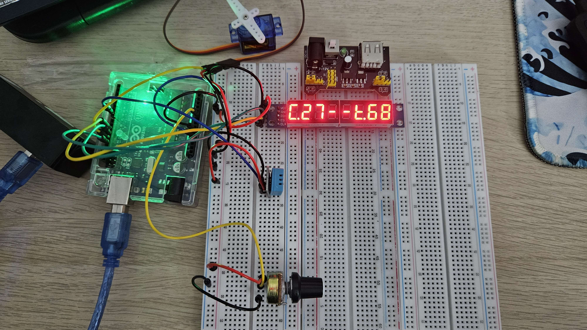
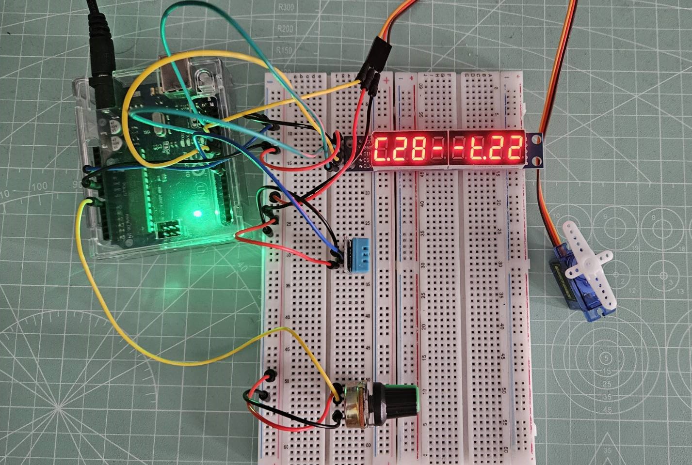

# Digital Thermostat
## Introduction to the problem and the solution
In today's world, energy conservation is a crucial factor for sustainability. The increasing cost of energy and its impact on the environment has led to the development of various technologies that enable us to conserve energy. One such technology is the digital thermostat, which helps in regulating the temperature of a building or a room to optimize energy consumption. Digital thermostats have replaced the traditional mechanical thermostats and offer greater precision and control over temperature settings.

Traditional mechanical thermostats are known for their inaccuracies and inefficiencies. They are difficult to calibrate and can result in inconsistent temperature control, leading to energy wastage. Moreover, they cannot be programmed to adjust temperature settings according to specific schedules, which can also lead to energy wastage. The lack of control and accuracy in traditional thermostats can result in increased energy consumption and higher energy bills.

Digital thermostats offer a solution to the problems associated with traditional thermostats. They are equipped with microprocessors that enable accurate temperature sensing and control. Digital thermostats can be programmed to adjust temperature settings according to specific schedules, resulting in optimized energy consumption. They can also be remotely controlled using smartphones or other devices, allowing for greater flexibility in temperature control. Additionally, digital thermostats can display energy usage information, enabling users to track and analyze their energy consumption patterns. Overall, digital thermostats provide a more efficient and precise way to regulate the temperature of a building or a room, leading to energy conservation and cost savings.

## Hardware design and implementation details
The room temperature will be controlled using a potentiometer as a knob. There will also be a room temperature reading from a DHT11 sensor installed, and it will transmit data via a serial connection. The target temperature and current temperature will be displayed on a 7-Segment Display. The temperature control will also affect a mini servo SG90 that will show the temperature change command from the potentiometer.

To implement this system, the following hardware components will be required:

- Microcontroller: A microcontroller will be used to manage and control the system.
- Potentiometer: A potentiometer will be used as a knob to control the room temperature.
- DHT11 Sensor: A DHT11 sensor will be used to measure the room temperature.
- Serial Connection: A serial connection will be used to transmit the temperature data from the sensor to the microcontroller.
- 7-Segment Display: A 7-Segment Display will be used to display the target temperature and the current temperature.
- Mini Servo SG90: A mini servo SG90 will be used to control the heating or cooling system in the room.

The thermostat implementation involves using a DHT11 sensor to measure room temperature and transmit data to an Arduino Uno. A potentiometer is used as a control knob to adjust the target temperature, which is displayed on the Max7219 7-Segment Display connected to the microcontroller. The SG90 mini servo is utilized to indicate temperature changes by responding to rotations of the potentiometer knob. Arduino Uno is chosen as the ideal microcontroller for this project due to its SPI capabilities for communication with the 7-segment display and its internal configurable timer for generating the required PWM signal for the servo. Additionally, the Arduino Uno can read analog signals through its built-in ADC.

## Software implementation details
The code consists of two main parts, initialization and the main loop. In the initialization state, the program will initiliaze everything needed for the program to do its' functions such as pins, enabling certain functionalities such as SPI. While the main loop consists of tasks that are needed to be done and that includes reading the data from DHT11 sensor and potentiomter, displaying those datas through the 7-segment display, and moving the servo based on those datas.

Some things that need to be noted is that the software needs to read data from a DHT11 sensor by receiving the data serially and storing it in data registers. Due to the sensor's slow sampling rate, delays need to be implemented using internal timers or the microcontroller's frequency. The program should also read data from a potentiometer using the ADC and convert it to a 10-bit value stored in registers. The data range needs to be adjusted from 0-1023 to 16-31 through arithmetic operations. The MAX7219 7-segment display will be used to display the received data using SPI communication. Finally, an SG90 servo will be controlled using PWM signals, where a value of 1500 represents a stationary state, and values above or below will move the servo in different directions, and timer is used to set the PWM signal length.

## Test results and performance evaluation

## Conclusion and future work
The implemented temperature control system offers users an easy-to-use and intuitive solution for temperature regulation. It incorporates the MAX7219 7-Segment Display and SG90 servo to provide precise temperature measurement, adjustable temperature targets, and visually appealing temperature displays. The system aims to enhance user experience with optimal display, control mechanisms, and responsiveness. Even though the results did not match our expectations, it was an amazing project to do and we hope to do more projects such as this but with better user experience and functionalities.
